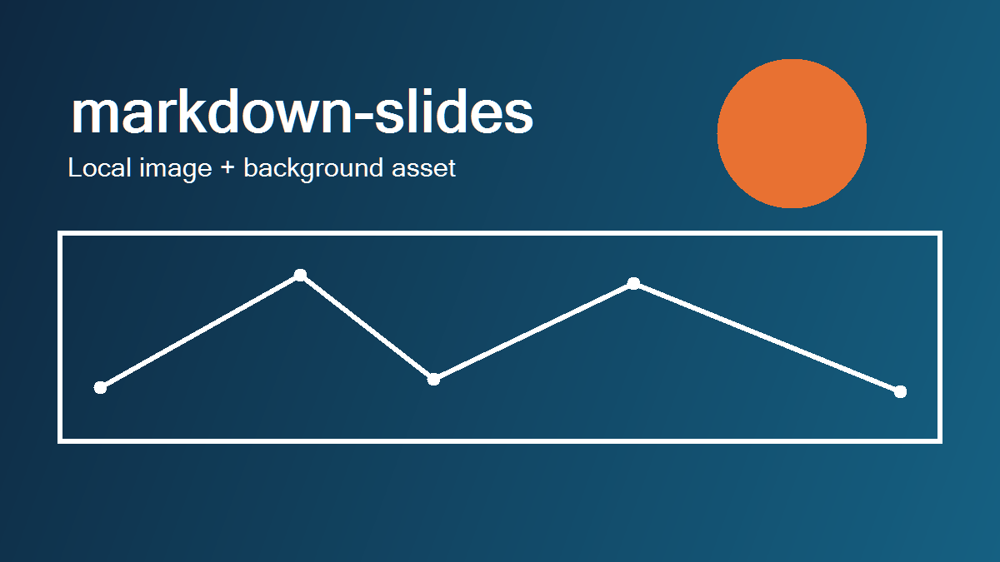

# markdown-slides showcase
---
layout: Title Slide
notes: |
  Features shown:
  - Title Slide layout selected in slide front matter.
  - H1 slide title mapped to the title placeholder.
  - Body text mapped to the subtitle placeholder.
  - Deck-level front matter for aspect ratio, fonts, color scheme, and a document linear-gradient background.
  - Theme color references inside gradients via var(--accent-1) style syntax.
  - Speaker notes stored from slide front matter.
---

Markdown in. Editable PowerPoint out.

# What this deck demonstrates
---
layout: Section Header
background: "linear-gradient(90deg, #0E2841 0%, #156082 100%)"
notes: |
  Features shown:
  - Section Header layout selected in slide front matter.
  - Slide-level gradient background override using restricted CSS-like syntax.
  - Body content mapped to the subtitle/body placeholder for this layout.
  - Title uses the Headings font from deck front matter.
---

Layouts, front matter, lists, headings, code, tables, images, notes, and backgrounds.

# Paragraphs and inline formatting
---
title_color: "var(--accent-1)"
body_color: "var(--dark-1)"
notes: |
  Features shown:
  - Default Title and Content layout.
  - Slide-level title_color and body_color overrides for placeholder text.
  - Theme color references for placeholder text using var(--theme-slot) syntax.
  - Standard paragraphs in the body placeholder.
  - Inline strong, emphasis, and inline code formatting.
  - Markdown links rendered inside text flow.
  - Deck-level Body and Headings font settings.
---

This paragraph shows **strong text**, *emphasis*, and `inline code` in the body placeholder.

Links also work as standard markdown, like [python-pptx](https://python-pptx.readthedocs.io/en/latest/) and [uv](https://docs.astral.sh/uv/).

The deck-level font mapping uses the Body font for paragraphs and the Headings font for slide titles and body headings.

# H2 through H6 stay inside the same slide
---
notes: |
  Features shown:
  - H2 through H6 stay within the current slide body instead of starting new slides.
  - Body headings use the Headings font while body paragraphs use the Body font.
  - Descending heading sizes are applied within one text-flow placeholder.
---

## H2 heading
H2 is rendered in the body flow rather than starting a new slide.

### H3 heading
This keeps the markdown readable while still allowing structure inside a slide.

#### H4 heading
The renderer applies descending heading sizes.

##### H5 heading
H5 still stays clearly above body text.

###### H6 heading
H6 is supported too.

# Lists
---
notes: |
  Features shown:
  - Unordered lists and ordered lists in the same Title and Content slide.
  - Nested list support up to three levels.
  - List content stays in text flow inside the body placeholder.
---

## Bulleted list
- First bullet
  - Nested bullet level two
    - Nested bullet level three
- Second bullet

## Ordered list
1. First step
2. Second step
   1. Nested ordered item
   2. Another nested ordered item
3. Third step

# Blockquotes and fenced code
---
notes: |
  Features shown:
  - Blockquote rendered as text-flow content.
  - Fenced code block rendering in the body placeholder.
  - Indented code blocks are intentionally unsupported by the parser.
---

> This blockquote stays in the text flow and renders as styled text in the body placeholder.

```python
def render_slide(title: str, body: str) -> str:
    return f"{title}: {body}"
```

# Pipe table
---
notes: |
  Features shown:
  - Pipe table markdown support.
  - Table rendered as a native PowerPoint table object.
  - Content documents key parser and renderer rules.
---

| Feature | Status | Notes |
| --- | --- | --- |
| H1 slide boundaries | Supported | `# Heading` starts a new slide |
| Slide front matter | Supported | Allowed only immediately after an H1 |
| Placeholder fallback textboxes | Not supported | Missing required placeholders are errors |

# Local image
---
notes: |
  Features shown:
  - Local image path resolved relative to the markdown file.
  - Standalone image paragraph rendered into the content region.
  - The same local asset is later reused as a slide background image.
---



# Background image via slide front matter
---
layout: Title Only
background: "url('./showcase-local.png')"
notes: |
  Features shown:
  - Title Only layout selected in slide front matter.
  - Slide-level background image using url(...) syntax.
  - Title Only slide has no body content, matching the enforced layout rules.
---

# Remote image
---
notes: |
  Features shown:
  - Remote image download at render time.
  - Downloaded image embedded directly into the PPTX.
  - Image-only content rendered in the content region.
---


# Radial gradient background
---
background: "radial-gradient(circle, var(--accent-1) 0%, var(--accent-2) 55%, var(--light-1) 100%)"
notes: |
  Features shown:
  - Slide-level radial-gradient background override.
  - Radial gradients use the constrained gradient syntax supported by the parser.
  - Gradient stops can reference theme colors via var(--theme-slot).
  - Content still uses the standard title and body placeholders.
---

This slide demonstrates a radial gradient background applied directly to the slide.

# No background fill on this slide
---
layout: Title Only
background: none
hide_background_graphics: true
notes: |
  Features shown:
  - background: none to remove explicit slide fill.
  - hide_background_graphics: true to disable inherited master graphics.
  - Title Only layout with title text only.
---

#
---
layout: Blank
notes: |
  Features shown:
  - Blank layout selected explicitly.
  - Empty H1 title and empty body satisfy blank slide validation rules.
  - Notes can still carry metadata even when the visible slide is empty.
---
